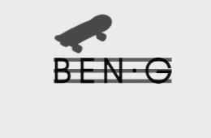
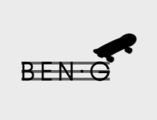
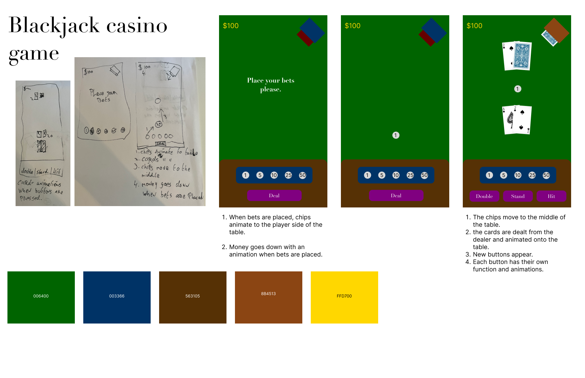
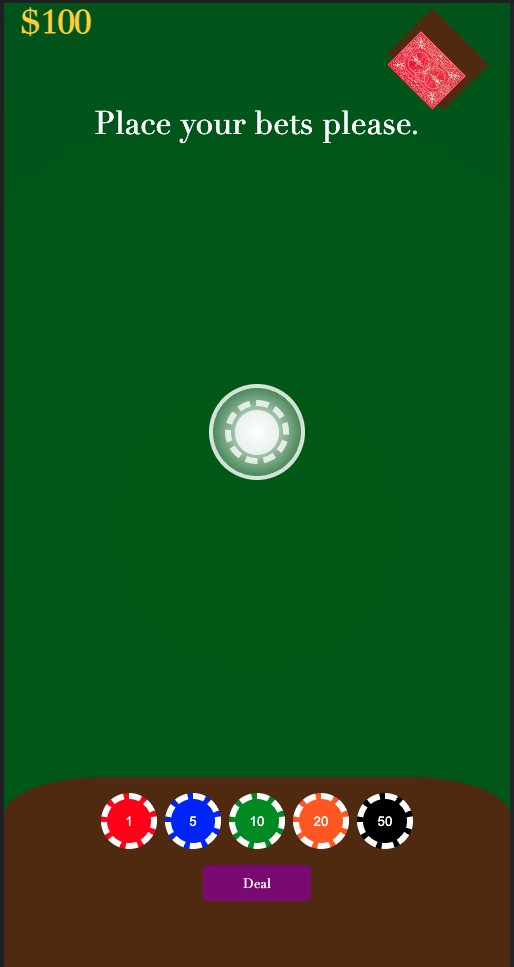
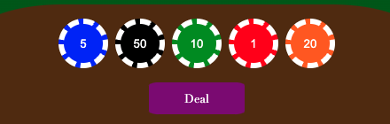
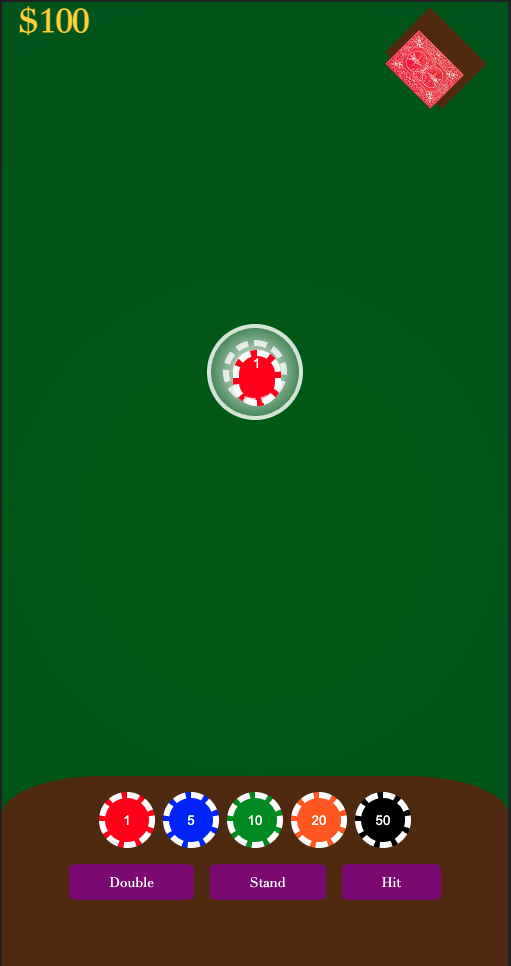
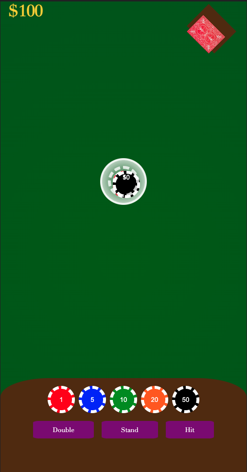

# Procesverslag
**Auteur:** Thije Wind

**De opdrachten:** [opdracht 1](./opdracht1/index.html) en [opdracht 2](opdracht2/index.html)

## Bronnenlijst
  1. [Background table gradient](https://css-tricks.com/grainy-gradients/)
  2. [Poker Chip design](https://codepen.io/hoangtx/pen/AaLwqb) 
  3. [BEN-G](https://www.ben-g.nl/)
  4. [keyboard shortcuts](https://www.youtube.com/watch?v=lNJMDTSkNXo)
  5. [keyboard functions](https://bestofjs.org/projects/hotkeys)
  6. [Card animation inspiration](https://codepen.io/nelledejones/pen/gOOPWrK)


## Opdracht 1 plan

<details open>
  <summary>I started off with making a moodboard  the brand BEN-G. After that I drew out the animations. The first idea is inspired by their logo on their store with the 3 stripes. This is the idea I ended up making.</summary>
  
  


  ### Je storyboard:

  

  ### Je ambitie: 
  Aan deze technieken/punten wil ik werken:
  - Het animeren met css.
  - Op de correcte en nieuwste manier, css schrijven.
  - Gebruik maken van custom properties.
 
</details>


## Opdracht 1 reflectie

<details>
  <summary>uitwerken bij afronden opdracht (voor week 4)</summary>


  ### Je uitkomst - karakteristiek screenshot(s):

    Tijdens het maken van de Ben-G opdracht ben ik uitgekomen op het idee met de 3 strepen. Ik heb hier voor gekozen omdat het goed bij het minimalistische logo van het bedrijf past. Tijdens het maken van de opdracht deden de strepen me denken aan bankjes of paaltjes waar je op kan skaten. Daarom heb ik later een skateboard toegevoegd wat een kickflip over 1 van de lijnen maakt.

  
  
  


  ### Dit ging goed/Heb ik geleerd: 

  Tijdens het maken van de eerste opdracht merkte ik dat ik het toch nog erg lastig vond om de "standaard" CSS te schrijven. Er zaten vaak slordige foutjes in die erg makkelijk op te lossen waren maar die ik dan maar niet kon vinden en veel te lang in bleef hangen. Toen er eenmaal een beetje iets stond ging het best goed, ik had nog nooit met @keyframes gewerkt dus vond het erg leuk en interessant om daar kennis mee te maken.

  ### Dit was lastig/Is niet gelukt:
 
 Ik wilde erg graag nog meer varianten van het logo maken en was daar ook al aan begonnen. Helaas door persoonlijke omstandigheden en drukte met andere vakken heb ik dat niet kunnen doen. De andere ideeën zijn terug te vinden in mijn storyboard.

</details>


## Opdracht 2 plan

<details>
  <summary>For the second project I want to make a blackjack casino game.</summary>


  ### Je ontwerp:
  


  ### Je ambitie: 
  Aan deze technieken/punten wil ik werken:
  - Custom properties gebruiken bij meer dan alleen kleuren en verloopjes.
  - Gebruik maken van JavaScript animation events.
  - Werken met voice commands.
  - Gebruik maken van APIs.
  - Werken met display p3 voor kleuren.
</details>


## Opdracht 2 test

<details>
  <summary>uitwerken na testen (week 7)</summary>

  1. Duidelijkheid, nog niet alle stappen waren duidelijk voor de gebruiken bijvoorbeeld het drag en droppen waar dit precies moest komen.
  2. Het sorteren werkt nog niet perfect.
  3. Een tip om wat met het geld te doen, daar zijn veel leuke interacties mee te bedenken.
  4. De kaarten uit de kaartmachine laten komen.
  5. Het totaal bedraag ergens aangeven, het is niet nu nog onduidelijk hoeveel je precies hebt ingezet.


  ### Bevinding 1:
  
  Eerder had ik in het midden van het spel geen duidelijke plek gemaakt waar de chips naar toe gesleept moesten worden. Hierdoor was het voor de gebruiker niet duidelijk wat hij precies moest doen, ook was er nog geen keyboard besturing mogelijk.

  #### oplossing:
  
   

  Hiervoor heb ik nu in het midden een kleinere chip gemaakt waardoor het voor de gebruiker duidelijker is wat er gebeuren moet. Ook heb ik via een keyframe de chip laten bewegen zodat het nog meer opvalt voor de gebruiker.


  ### Bevinding 2:
  
  Het sorteren werkt nog niet goed, het heen en weer slepen van items gaat goed maar je kon nog steeds de chips onder in sorteren. Het lukt me helaas echt niet om dit op te lossen ik heb alle documentatie gelezen en precies gedaan wat er staat maar kan de fout echt niet vinden. 
  
  
  Dit is m'n code voor SortableJS: 
``` javascript

const chips = document.querySelector('.chips')
const chipStack = document.querySelector('.chipStack')


const bottomChips = new Sortable(chips, {
    group: {
        name: 'shared',
        pull: 'clone',
        sort: false
        // Doesnt work ?!
    },
    animation: 50
});

const middleStack = new Sortable(chipStack, {
    group: {
        name: 'shared',
        pull: 'true',
        sort: false
    },
    animation: 50
});

```


  ### Bevinding 3:

  Helaas ben ik er niet aan toe gekomen om het geld en de chips samen te laten werken. Ik had allerlei ideeën bedacht over leuke animaties en hoe je het geld omhoog en omlaag kon laten gaan.

</details>


## Opdracht 2 reflectie

<details>
  <summary>uitwerken bij afronden opdracht (voor week 8)</summary>

  ### Je uitkomst - karakteristiek screenshot(s):
  Dit is uiteindelijk de pagina geworden: 
   

  Je kan dus via drag en drop je chips op de tafel leggen en weer terug halen. De cirkel in het midden trek nu de aandacht van de gebruiker doordat deze knippert. Het spel kan ook met keyboard gebruikt worden, door de knoppen 1 tot en met 5 te gebruiken kan je ook chips inzetten. De kaarten komen uit de kaarten schudder op tafel te liggen en worden omgeflipt. Helaas ging dit vlak voor de deadline stuk dus kan ik geen voorbeeld er van laten zien. 
  


  ### Dit ging goed/Heb ik geleerd: 
  
  Waar ik het meest blij mee ben om geleerd te hebben is het werken met verschillende libraries, zoals bijvoorbeeld SortableJS. Dit maakt het werken met code gewoon zoveel gemakkelijker en sneller, ik had hier nog nooit mee gewerkt en heb daar echt veel van geleerd.
  


   Ook de animaties vond ik erg leuk om te maken en ben ik blij met het resultaat. Persoonlijk vind ik de animatie van opdracht 1 echt perfect bij het bedrijf passen ook al zijn het niet overdreven veel animaties, ben ik erg blij met wat ik heb gemaakt. Tijdens de tweede opdracht heb ik echt extreem veel CSS geleerd en ook ontdekt dat ik het erg leuk en interresant vindt. 



  ### Dit was lastig/Is niet gelukt:
  
  Het sorteren ben ik echt heel lang mee bezig geweest maar kreeg ik gewoon echt niet voor elkaar. De code lijkt heel simpel en er kan in mijn ogen weinig fout gaan, maar het zal wel wat kleins zijn. Ook vind ik het jammer dat ik niet al m'n ideeen op tijd heb kunnen uitwerken doordat ik merkte dat ik erg veel moeite had met grid. Hiervoor heb ik eigenlijk alleen noog maar met Flexbox gewerkt dus wilde ik mezelf uitdagen om voornamelijk grid te gebruiken (en ook een beetje omdat ik het Sanne altijd zie gebruiken). Ook wilde ik op het laatste moment nog een extra animatie toevoegen bij het uitdelen van de kaarten waardoor de halve pagina het niet meer deed. 


</details>